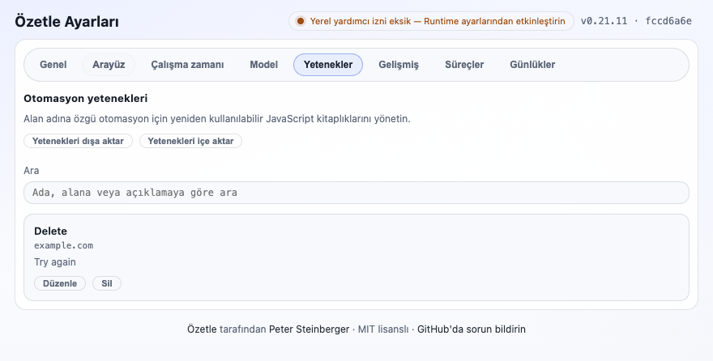

# PR #398 kanıt kaydı

Bu kayıt, `fccd6a6e0bc27e6c1e5a8afabb90dfbb4ab0e0a2` HEAD’i üzerinde PR #398 için
ClawSweeper’ın istediği Türkçe CLI ve Chromium extension davranış kanıtlarını toplar.

- Tarih/saat: 2026-09-01, Europe/Istanbul (`+03:00`)
- Test edilen HEAD: `fccd6a6e0bc27e6c1e5a8afabb90dfbb4ab0e0a2`
- HEAD konusu: `fix: preserve saved skill metadata in Turkish UI`
- Kanıt checkout’u: repository root; aşağıdaki dosya ve komut yolları repo-relative’dir.
- Secret, API key, kullanıcı hesabı veya gerçek kullanıcı verisi kullanılmadı.
- 404, sahte URL veya yalnızca başarısız komut çıktısı başarı kanıtı olarak kullanılmadı.

Screenshot gizlilik kontrolü: görsel yalnızca extension’ın options UI’sini, build bilgisi,
sentetik `example.com` / `Delete` / `Try again` fixture değerlerini ve uygulamanın sabit public
attribution satırını gösterir. E-posta, hesap kimliği, token, cookie, gerçek kullanıcı domain’i,
yerel dosya yolu veya kullanım verisi görünmez.

## Türkçe CLI

Çalıştırılan komut:

```sh
SUMMARIZE_LOCALE=tr pnpm dev:cli --help
```

Komut exit code `0` ile tamamlandı. Gerçek terminal çıktısından kısa bölüm:

```text
Kullanım: summarize [options] [input]

Web sayfalarını ve YouTube bağlantılarını özetleyin (doğrudan sağlayıcı API anahtarlarını kullanır).

Argümanlar:
  input                             Özetlenecek URL, yerel dosya yolu veya stdin için - (metin ya da ikili veri)

Seçenekler:
  --slides [value]                  YouTube/doğrudan video URL'lerinden veya yerel video dosyalarından slaytları çıkarıp (desteklendiğinde) özet metnine satır içi olarak ekle.
  --locale <locale>                 CLI arayüz dili: auto/en veya tr/turkish (varsayılan: en; SUMMARIZE_LOCALE ile de ayarlanabilir)
```

Bu çıktı, Türkçe başlıkların (`Kullanım`, `Argümanlar`, `Seçenekler`) ve Türkçe seçenek
açıklamalarının gerçek CLI çalıştırmasında göründüğünü kanıtlar.

## Ağsız slayt/parser kontrolü

Mevcut yerel fixture ile, ağ gerektirmeyen odaklı test koşusu:

```sh
pnpm exec vitest run tests/slides.parse-showinfo.test.ts tests/slides.output.parse.test.ts tests/slides.text-markdown.coverage.test.ts tests/ffmpeg-wasm.test.ts
```

Sonuç: `4 passed (4)` test dosyası, `16 passed (16)` test, exit code `0`.
`tests/ffmpeg-wasm.test.ts`, `apps/chrome-extension/tests/fixtures/ffmpeg-wasm-sample.mp4`
fixture’ını kullanır; bu kanıt için dış URL veya network çağrısı kullanılmadı.

## Extension build’leri

```sh
pnpm -C apps/chrome-extension build
```

Sonuç: Chrome MV3 production build başarılı, exit code `0` (`✔ Built extension`).

```sh
pnpm -C apps/chrome-extension build:firefox
```

Sonuç: Firefox MV3 production build başarılı, exit code `0` (`✔ Built extension`). WXT’nin
Firefox için `offscreen` entrypoint’ini atladığı uyarısı beklenen build davranışıdır; build
başarısız olmadı.

## Gerçek Chromium UI kanıtı

Chrome production build’ini yükleyen mevcut Playwright harness ile headed Chromium koşusu:

```sh
HEADLESS=0 SHOW_UI=1 env -u NO_COLOR pnpm -C apps/chrome-extension exec playwright test -c playwright.config.ts --project=chromium tests/locale.browser.spec.ts
```

Sonuç: `1 passed`, exit code `0`.

Headless Chromium ile yapılan ön deneme, test başlamadan Chrome for Testing’in Crashpad
izinleri nedeniyle `SIGABRT` ile kapandı; bu deneme başarı kanıtı olarak sayılmadı. Yukarıdaki
headed koşu, UI ve screenshot için kullanılan tek başarılı koşudur.

Testin doğruladığı gerçek extension davranışı:

- `body` üzerinde Türkçe UI locale durumu mevcut.
- UI sekmesinde `Arayüz dili` görünür.
- `#languagePreset option[value=tr]` metni `Türkçe`.
- `#uiLocale` değeri `tr`.
- Skills sekmesinde Türkçe `Otomasyon yetenekleri` başlığı görünür.
- Kaydedilmiş kullanıcı skill metadata’sı aynen korunur: ad `Delete`, domain pattern `example.com`, açıklama `Try again`.

Screenshot, Skills sekmesi aktifken gerçek Chromium options UI’sinden alınmıştır:



Dosya bilgisi: `880x446`, 77999 byte; oluşturulma zamanı `2026-09-01 17:33:54 +03:00`;
SHA-256 `21d94b97812d0fc8b8e65981e4f1c0ec123a4a4817fcadbc9d71626b3e8fae90`.
Görsel, Türkçe sekmeleri ve başlığı birlikte `Delete`, `example.com` ve `Try again`
değerleriyle gösterir. Dil seçicisinin `Arayüz dili` / `Türkçe` durumu aynı testte DOM
assertion’larıyla doğrulanmıştır.

## Tam kontrol kapısı

```sh
pnpm check
```

Sandbox’ın localhost dinleme izni olmadan yapılan ilk koşuda bazı daemon/publish testleri
`listen EPERM: operation not permitted 127.0.0.1` nedeniyle çalışamadı; bu çıktı başarı kanıtı
olarak sayılmadı. Gerekli yerel test sunucusu izniyle tekrar çalıştırılan koşunun sonucu:

- `558 passed | 29 skipped` test dosyası
- `3032 passed | 43 skipped` test
- Coverage: Statements `91.8%`, Branches `85.19%`, Functions `94.25%`, Lines `94.15%`
- exit code `0`

## PR body’ye eklenecek kısa metin

```md
Verified on commit `fccd6a6e0bc27e6c1e5a8afabb90dfbb4ab0e0a2`:

- `SUMMARIZE_LOCALE=tr pnpm dev:cli --help` exits 0 and shows Turkish `Kullanım`, `Argümanlar`, `Seçenekler`, `--slides`, and `--locale` text.
- Local, network-free slide/parser fixture tests pass: 4 files / 16 tests.
- Chrome and Firefox MV3 production builds pass.
- Real headed Chromium Playwright test passes 1/1 with `uiLocale: "tr"`; it verifies `Arayüz dili`, selected `Türkçe`, and preserves saved skill metadata `Delete`, `example.com`, `Try again`.


Full check: 3032 passed, 43 skipped; coverage lines 94.15%. No 404 or failed network output is used as evidence.
```
